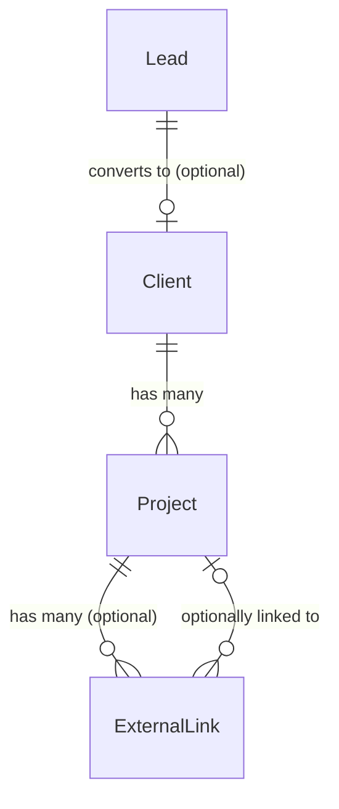
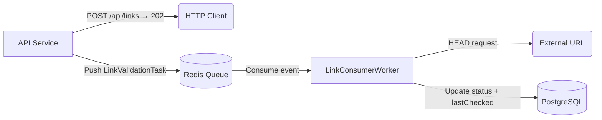

# Architecture — Vantage

## Tech Stack

| Layer              | Technology                                                                              |
| :----------------- | :-------------------------------------------------------------------------------------- |
| **Backend**        | Java 21, Spring Boot 3.4, Spring Data JPA, Spring Data Redis, Lombok, SpringDoc OpenAPI |
| **Database**       | PostgreSQL 14+ (local dev via Docker), Flyway for schema migrations                     |
| **Message Broker** | Redis 7+ (local dev via Docker) — used for async link validation queue                  |
| **Frontend**       | React (Vite) + TypeScript, Tailwind CSS, Recharts (charts), Axios (HTTP)                |
| **DevOps**         | Docker, docker-compose, GitHub Actions (CI), AWS (RDS, ElastiCache, EC2) for production |

---

## Folder Structure

**Backend (Maven):**

```
src/main/java/com/vantage/api/
  config/       — Spring config, Swagger, CORS, Redis
  controller/   — REST controllers
  service/      — Business logic and transactional services
  worker/       — Background queue consumers
  repository/   — Spring Data JPA repositories
  entity/       — JPA entities
  dto/          — Request/response DTOs and mappers
  exception/    — Global exception handling (@ControllerAdvice)

src/main/resources/
  application.yml
  db/migration/ — Flyway SQL migrations
```

**Frontend (Vite):**

```
src/
  api/          — Axios client and API service functions
  components/   — Reusable UI components (badges, cards, modals, forms)
  pages/        — Route-level page components
  types/        — TypeScript interfaces and enums
  layouts/      — Shell layout (sidebar, header)
```

---

## Data Schema

### Entity Relationships



- A `Lead` _may_ be converted into a `Client` (one-to-zero-or-one).
- A `Client` _has many_ `Project`s. A client **cannot be hard-deleted** if they have any associated projects — use `ARCHIVED` status instead.
- A `Project` _has many_ `ExternalLink`s. Deleting a project **cascade-deletes** all its links.
- An `ExternalLink` _may_ belong to a `Project`, but can also be standalone (orphaned).

---

### Entity: `Lead`

Represents a potential client inquiry — the entry point of the CRM pipeline.

| Field          | DB Column        | Java Type           | Nullable |          Default           | Notes                                                                           |
| :------------- | :--------------- | :------------------ | :------: | :------------------------: | :------------------------------------------------------------------------------ |
| `id`           | `id`             | `UUID`              |    ✗     |  Auto (`@GeneratedValue`)  | Primary key                                                                     |
| `name`         | `name`           | `String`            |    ✗     |             —              | Full name of the contact. Required on creation.                                 |
| `email`        | `email`          | `String`            |    ✗     |             —              | Email address. Required on creation.                                            |
| `phone`        | `phone`          | `String`            |    ✓     |           `null`           | Phone number. Optional.                                                         |
| `company`      | `company`        | `String`            |    ✓     |           `null`           | Organisation or company name. Optional.                                         |
| `source`       | `source`         | `String`            |    ✓     |           `null`           | How they found you (e.g. "Instagram", "Referral"). Optional.                    |
| `notes`        | `notes`          | `TEXT`              |    ✓     |           `null`           | Free-form notes. Optional.                                                      |
| `status`       | `status`         | `LeadStatus` (Enum) |    ✗     |         `INBOUND`          | Lifecycle status. See transition rules below.                                   |
| `followUpDate` | `follow_up_date` | `LocalDateTime`     |    ✓     |           `null`           | Scheduled follow-up reminder date. Optional.                                    |
| `convertedAt`  | `converted_at`   | `LocalDateTime`     |    ✓     |           `null`           | Auto-set by the service when status changes to `CONVERTED`. Never set manually. |
| `createdAt`    | `created_at`     | `LocalDateTime`     |    ✗     |   Auto (`@CreatedDate`)    | Set once on insert by JPA auditing.                                             |
| `updatedAt`    | `updated_at`     | `LocalDateTime`     |    ✗     | Auto (`@LastModifiedDate`) | Updated automatically on every save by JPA auditing.                            |

**Status Enum — `LeadStatus`:**

| Value       | Meaning                                                                                               |
| :---------- | :---------------------------------------------------------------------------------------------------- |
| `INBOUND`   | New unsolicited inquiry received. **Default on creation.**                                            |
| `OUTBOUND`  | You reached out to them proactively.                                                                  |
| `FOLLOW_UP` | Awaiting a follow-up; `followUpDate` should be set.                                                   |
| `CONVERTED` | Lead became a client. Terminal state — no further transitions allowed. `convertedAt` is auto-stamped. |
| `LOST`      | Lead did not proceed. Terminal state — no further transitions allowed.                                |

**Status Transition Rules:**

- `CONVERTED` and `LOST` are **terminal states**. Once a lead reaches either, its status cannot be changed again.
- The conversion path (`INBOUND / OUTBOUND / FOLLOW_UP` → `CONVERTED`) is the only way to create a linked `Client`.
- The `LeadService` enforces these rules and throws a `IllegalStateException` (mapped to `409 Conflict`) for invalid transitions.

**Deletion Rules:**

- A lead with status `CONVERTED` **cannot be deleted** — it is part of the audit trail for the linked `Client` (throws `409 Conflict`).
- Leads in any other status (`INBOUND`, `OUTBOUND`, `FOLLOW_UP`, `LOST`) may be hard-deleted freely.

---

### Entity: `Client`

Represents a confirmed client. May be created manually or by converting a `Lead`.

| Field             | DB Column           | Java Type                | Nullable |          Default           | Notes                                                                                    |
| :---------------- | :------------------ | :----------------------- | :------: | :------------------------: | :--------------------------------------------------------------------------------------- |
| `id`              | `id`                | `UUID`                   |    ✗     |  Auto (`@GeneratedValue`)  | Primary key                                                                              |
| `fullName`        | `full_name`         | `String`                 |    ✗     |             —              | Full legal name (used on invoices). Required.                                            |
| `email`           | `email`             | `String`                 |    ✗     |             —              | Primary email. Required.                                                                 |
| `phone`           | `phone`             | `String`                 |    ✓     |           `null`           | Phone number. Optional.                                                                  |
| `company`         | `company`           | `String`                 |    ✗     |             —              | Company or trading name. Required.                                                       |
| `companyNumber`   | `company_number`    | `String`                 |    ✓     |           `null`           | Business registration number. Optional; used for formal invoicing.                       |
| `address`         | `address`           | `TEXT`                   |    ✓     |           `null`           | Billing address. Optional; used for formal invoicing.                                    |
| `logoUrl`         | `logo_url`          | `String`                 |    ✓     |           `null`           | URL to client logo image. Optional.                                                      |
| `primaryContact`  | `primary_contact`   | `String`                 |    ✓     |           `null`           | Name/role of the main point of contact (if different from `fullName`). Optional.         |
| `notes`           | `notes`             | `TEXT`                   |    ✓     |           `null`           | Free-form notes. Optional.                                                               |
| `status`          | `status`            | `ClientStatus` (Enum)    |    ✗     |          `ACTIVE`          | Lifecycle status of the client. See enum below.                                          |
| `convertedFromId` | `converted_from_id` | `UUID` (FK → `leads.id`) |    ✓     |           `null`           | Set automatically when created via lead conversion. `null` for manually created clients. |
| `createdAt`       | `created_at`        | `LocalDateTime`          |    ✗     |   Auto (`@CreatedDate`)    | Set once on insert by JPA auditing.                                                      |
| `updatedAt`       | `updated_at`        | `LocalDateTime`          |    ✗     | Auto (`@LastModifiedDate`) | Updated automatically on every save by JPA auditing.                                     |

**Status Enum — `ClientStatus`:**

| Value      | Meaning                                                   |
| :--------- | :-------------------------------------------------------- |
| `ACTIVE`   | Current working client. **Default on creation.**          |
| `ARCHIVED` | No longer active; retained for historical record-keeping. |

**Notes on `convertedFromId`:**

- When `POST /api/leads/{id}/convert` is called, the service creates a `Client` pre-populated from the lead's `name`, `email`, `phone`, and `company`, and sets `convertedFromId` to the lead's UUID.
- When a client is created directly via `POST /api/clients`, `convertedFromId` is `null`.
- Deleting a lead does **not** delete the client (the FK is nullable and not cascaded in this direction).

**Deletion Rules:**

- A `Client` **cannot be hard-deleted** if they have any associated `Project`s (throws `409 Conflict`).
- Hard deletion is only permitted if the client has **zero projects** (e.g. created by mistake).
- To retire an active client, set their `status` to `ARCHIVED` via `PATCH /api/clients/{id}/status`.

---

### Entity: `Project`

Represents a video project belonging to a client.

| Field         | DB Column     | Java Type                  | Nullable |          Default           | Notes                                                                                           |
| :------------ | :------------ | :------------------------- | :------: | :------------------------: | :---------------------------------------------------------------------------------------------- |
| `id`          | `id`          | `UUID`                     |    ✗     |  Auto (`@GeneratedValue`)  | Primary key                                                                                     |
| `clientId`    | `client_id`   | `UUID` (FK → `clients.id`) |    ✗     |             —              | Owning client. Required. Cannot be changed after creation.                                      |
| `title`       | `title`       | `String`                   |    ✗     |             —              | Short project title. Required.                                                                  |
| `description` | `description` | `TEXT`                     |    ✓     |           `null`           | Longer description or scope notes. Optional.                                                    |
| `status`      | `status`      | `ProjectStatus` (Enum)     |    ✗     |         `UPCOMING`         | Current project lifecycle stage.                                                                |
| `price`       | `price`       | `BigDecimal`               |    ✓     |           `null`           | Agreed price for the project. Optional in V1; used by the financial dashboard later.            |
| `currency`    | `currency`    | `String`                   |    ✓     |          `'CAD'`           | ISO 4217 currency code (e.g. `CAD`, `USD`, `EUR`). Defaults to `CAD`. Stored alongside `price`. |
| `notes`       | `notes`       | `TEXT`                     |    ✓     |           `null`           | Free-form notes. Optional.                                                                      |
| `createdAt`   | `created_at`  | `LocalDateTime`            |    ✗     |   Auto (`@CreatedDate`)    | Set once on insert by JPA auditing.                                                             |
| `updatedAt`   | `updated_at`  | `LocalDateTime`            |    ✗     | Auto (`@LastModifiedDate`) | Updated automatically on every save by JPA auditing.                                            |

**Status Enum — `ProjectStatus`:**

| Value       | Meaning                                                                        |
| :---------- | :----------------------------------------------------------------------------- |
| `UPCOMING`  | Project is scoped and agreed but work hasn't started. **Default on creation.** |
| `ACTIVE`    | Currently being worked on.                                                     |
| `IN_REVIEW` | Delivered to client for feedback/approval.                                     |
| `DELIVERED` | Final files handed off; project is complete.                                   |
| `ARCHIVED`  | Closed/cancelled project retained for record-keeping.                          |

**Deletion Rules:**

- A `Project` with status `ACTIVE`, `IN_REVIEW`, or `DELIVERED` **cannot be hard-deleted** (throws `409 Conflict`) — use `ARCHIVED` instead.
- Only `UPCOMING` projects (no work started) may be hard-deleted. Deletion **cascade-deletes** all associated `ExternalLink`s.

---

### Entity: `ExternalLink`

An external URL attached optionally to a project, validated asynchronously in the background.

| Field         | DB Column      | Java Type                   | Nullable |          Default           | Notes                                                                              |
| :------------ | :------------- | :-------------------------- | :------: | :------------------------: | :--------------------------------------------------------------------------------- |
| `id`          | `id`           | `UUID`                      |    ✗     |  Auto (`@GeneratedValue`)  | Primary key                                                                        |
| `projectId`   | `project_id`   | `UUID` (FK → `projects.id`) |    ✓     |           `null`           | Links the URL to a project. `null` if not associated with any project.             |
| `url`         | `url`          | `String`                    |    ✗     |             —              | The full external URL (e.g. Google Drive, Frame.io). Required.                     |
| `name`        | `name`         | `String`                    |    ✓     |           `null`           | Human-readable label for the link (e.g. "Final Cut v3"). Optional.                 |
| `status`      | `status`       | `LinkStatus` (Enum)         |    ✗     |         `PENDING`          | Validation state. Set to `PENDING` on insert; updated by the worker.               |
| `lastChecked` | `last_checked` | `LocalDateTime`             |    ✓     |           `null`           | Timestamp of the last HEAD-request validation. `null` until first check completes. |
| `createdAt`   | `created_at`   | `LocalDateTime`             |    ✗     |   Auto (`@CreatedDate`)    | Set once on insert by JPA auditing.                                                |
| `updatedAt`   | `updated_at`   | `LocalDateTime`             |    ✗     | Auto (`@LastModifiedDate`) | Updated automatically on every save by JPA auditing.                               |

**Status Enum — `LinkStatus`:**

| Value       | Meaning                                         |
| :---------- | :---------------------------------------------- |
| `PENDING`   | Queued for validation. **Default on creation.** |
| `VALIDATED` | HEAD request succeeded (2xx response).          |
| `BROKEN`    | HEAD request failed (4xx/5xx or timeout).       |

**Async Validation Flow:**

1. `POST /api/links` is called with a URL (and optional `projectId`).
2. The API returns `202 Accepted` immediately — status is `PENDING`.
3. `LinkProducerService` pushes a `LinkValidationTask` message onto the Redis queue.
4. `LinkConsumerWorker` picks up the task, performs a HEAD request, and updates the `ExternalLink` status to `VALIDATED` or `BROKEN`, setting `lastChecked` to now.

---

## JPA Auditing Notes

`createdAt` and `updatedAt` are managed automatically by Spring Data JPA auditing (`@EnableJpaAuditing`). They use the `@CreatedDate` and `@LastModifiedDate` annotations on an `@MappedSuperclass` (e.g. `BaseEntity`), so no manual setting is ever needed.

---

## Architecture & Async Messaging Flow



---

## API Overview

### Lead Endpoints

| Method   | Path                      | Description                                                    |
| :------- | :------------------------ | :------------------------------------------------------------- |
| `POST`   | `/api/leads`              | Create a new lead (status defaults to `INBOUND`)               |
| `GET`    | `/api/leads`              | List leads (optional `?status=` filter)                        |
| `GET`    | `/api/leads/{id}`         | Get lead by ID                                                 |
| `PUT`    | `/api/leads/{id}`         | Update lead fields                                             |
| `DELETE` | `/api/leads/{id}`         | Delete lead — rejected with `409` if status is `CONVERTED`     |
| `PATCH`  | `/api/leads/{id}/status`  | Change lead status (validated against transition rules)        |
| `POST`   | `/api/leads/{id}/convert` | Convert lead → Client (sets `CONVERTED`, stamps `convertedAt`) |

### Client Endpoints

| Method   | Path                       | Description                                                 |
| :------- | :------------------------- | :---------------------------------------------------------- |
| `POST`   | `/api/clients`             | Create a client manually (`convertedFromId` will be `null`) |
| `GET`    | `/api/clients`             | List all clients                                            |
| `GET`    | `/api/clients/{id}`        | Get client by ID                                            |
| `PUT`    | `/api/clients/{id}`        | Update client                                               |
| `DELETE` | `/api/clients/{id}`        | Delete client — rejected with `409` if any projects exist   |
| `PATCH`  | `/api/clients/{id}/status` | Archive or reactivate a client (`ACTIVE` / `ARCHIVED`)      |

### Project Endpoints

| Method   | Path                 | Description                                                                             |
| :------- | :------------------- | :-------------------------------------------------------------------------------------- |
| `POST`   | `/api/projects`      | Create project (`clientId` required in body; status defaults to `UPCOMING`)             |
| `GET`    | `/api/projects`      | List all (optional `?clientId=` filter)                                                 |
| `GET`    | `/api/projects/{id}` | Get project by ID                                                                       |
| `PUT`    | `/api/projects/{id}` | Update project                                                                          |
| `DELETE` | `/api/projects/{id}` | Delete project — rejected with `409` if status is not `UPCOMING`; cascade-deletes links |

### Link Endpoints _(existing)_

| Method | Path         | Description                                                    |
| :----- | :----------- | :------------------------------------------------------------- |
| `POST` | `/api/links` | Queue a new link for async validation (returns `202 Accepted`) |

---

## Local Dev: docker-compose

```yaml
version: "3.8"
services:
  db:
    image: postgres:14
    environment:
      POSTGRES_DB: vantage_db
      POSTGRES_USER: postgres
      POSTGRES_PASSWORD: postgres
    ports:
      - "5432:5432"
  redis:
    image: redis:7-alpine
    ports:
      - "6379:6379"
```

Start dev services with `docker-compose up -d`.
