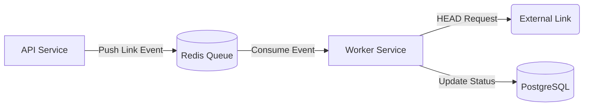

## Tech Stack

- **Backend:** Java 21, Spring Boot 3.4, Spring Data JPA, Spring Data Redis, Lombok, SpringDoc OpenAPI (Swagger UI).
- **Database:** PostgreSQL 14+ (local dev via Docker), Flyway or Liquibase for migrations.
- **Message Broker:** Redis 7+ (local dev via Docker).
- **Frontend:** React (Vite) + TypeScript, Tailwind CSS, Recharts for charts, Axios for HTTP.
- **DevOps:** Docker, docker-compose, GitHub Actions (CI), AWS (RDS, Elasticache, EC2) for production.

## Folder Structure (recommended)

Backend (Maven/Gradle project):

- `src/main/java/com/yourorg/vantage` — application packages
  - `config` — Spring configuration, Swagger, CORS, Redis
  - `controller` — REST controllers
  - `service` — business logic and transactional services
  - `worker` — background consumers and workers
  - `repository` — Spring Data JPA repositories
  - `model` or `entity` — JPA entities
  - `dto` — request/response DTOs and mappers
  - `exception` — centralized exception handling

- `src/main/resources` — `application.yml`, `db/migration` (Flyway)

## Architecture & Messaging Flow

Vantage uses an asynchronous architecture for external link validation to ensure a responsive UI.



- **LinkProducerService:** Pushes a validation message to Redis when a project link is created.
- **LinkConsumerWorker:** Listens to the Redis queue, performs an asynchronous validation (HEAD request), and updates the `ExternalLink` status in the database.

## Data Schema

- Entities: `Lead`, `Client`, `Project`, `ExternalLink`.
- Relationships:
  - One `Client` -> Many `Project` (One-to-Many).
  - One `Project` -> Many `ExternalLink` (One-to-Many).

Suggested entity fields:

- `ExternalLink`:
  - `id: UUID`, `projectId: UUID`, `url: String`, `name: String`, `status: ENUM (PENDING, VALIDATED, BROKEN)`, `lastChecked: LocalDateTime`
- `Project`:
  - `id: UUID`, `clientId: UUID`, `title`, `status: ENUM`, `revenue: BigDecimal`, `notes`, `createdAt`, `updatedAt`

## API & Asynchrony

- **Asynchronous Processing:** The `POST /api/projects` endpoint returns `202 Accepted` immediately after the link is queued.
- **Observability:**
  - **Health Checks:** Custom actuator endpoints report Redis connection health and queue depth.
  - **Metrics:** Micrometer tracks `link.validation.latency` (time from Pending to Validated).

## Local Dev: docker-compose

```yaml
version: "3.8"
services:
  db:
    image: postgres:14
    environment:
      POSTGRES_DB: vantage_db
      POSTGRES_USER: postgres
      POSTGRES_PASSWORD: postgres
    ports:
      - "5432:5432"
  redis:
    image: redis:7-alpine
    ports:
      - "6379:6379"
```

Start dev services with `docker-compose up -d`.
